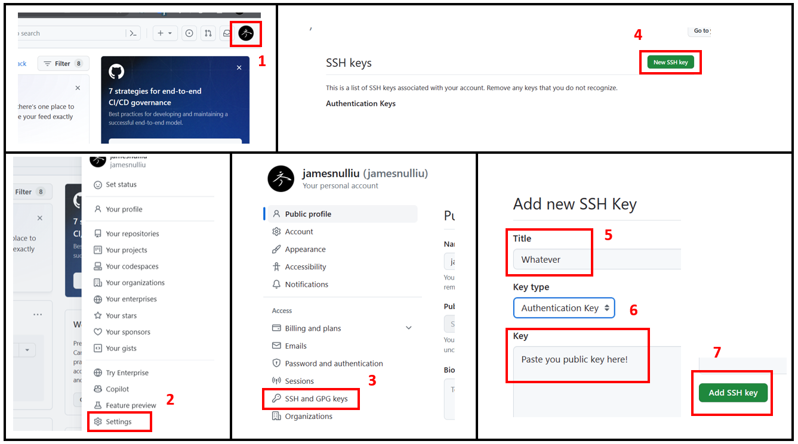

## 1. 简介

SSH 是一种网络协议, 用于计算机之间的加密登录和数据传输. 一对 SSH 密钥由一个私钥和一个公钥组成, 私钥保存在本地, 公钥保存在远程服务器上.

简单来说: 你将公钥分发给全世界; 他人用你的公钥加密信息, 只有你的私钥才能解密; 你用你的私钥签名信息, 只有你的公钥才能验证.

> 💬 目前有两种主流的算法生成密钥, 一种是 rsa, 另一种是 ed25519. ed25519 是一种 ECC 算法, 比起传统的 rsa 更加安全和高效. 参考资料: [Ed25519: high-speed high-security signatures](http://ed25519.cr.yp.to/) .

本文使用 ed25519 算法生成密钥.

**💡 重点**
- 当你将一对 SSH 密钥绑定到了你的 GitHub 账号后, 你可以在任何电脑上通过私钥访问你的 GitHub 账号.
- 你可以生成额外的密钥, 然后专门利用一对密钥控制一个储存库 (称为 Deploy Key). 该密钥只能访问一个储存库, 而不能访问你的账号.
- SSH 连接 GitHub 通过 443 端口 (而非 22 端口). 由于在国内连接 GitHub 走 22 端口很可能被屏蔽, 因此使用 SSH 连接 GitHub 会更加稳定.


## 2. 生成一对 SSH 密钥

在任意位置打开终端 (**Windows 用户请打开 Git Bash**), 通过以下命令在当前用户的个人文件夹下创建一个叫 `.ssh` 的文件夹 (如果已经创建, 终端会报错说文件夹已存在; 忽视即可):

```bash
mkdir ~/.ssh
```

通过以下命令创建一对 SSH 密钥:

```bash
ssh-keygen -t ed25519 -C "your@email.com" -f ~/.ssh/your-key-name
```

> 💡 **命令解释**
> - `ssh-keygen` 表示生成 ssh 密钥
> - `-t ed25519` 表示使用 ed25519 算法; 如果使用 rsa 算法, 建议输入 `-t rsa -b 4096`, 即生成 4096 bits 的密钥
> - `-C "your@email.com"` 是对该密钥的说明, 引号内的 `your@email.com` 可以替换成任何文字;
> - `-f ~/.ssh/your-key-name` 指出了密钥的生成路径以及密钥的文件名 (可以按需更改), 文件名可以依据自己的需求更改, 但是不要保留后缀名.

输入命令后终端提示设置密钥的密码, 建议设置一个密码.

> 📌 **注意**: 在你输入密码时, 终端的界面上不会显示出白色的输入内容字符 (看起来和没输入一样), 这是对周围环境的防范.

再次输入与刚刚相同的密码, 匹配成功后提示密钥成功生成, 并输出了密钥的指纹和随机图像; 可以忽略这些内容.

> 💡 **检查密钥是否成功生成**: 通过命令 `ls ~/.ssh` 可以查看路径下的所有文件; 你应该至少看到两个文件, 一个是 `your-key-name`, 另一个是 `your-key-name.pub`, 分别对应私钥和公钥.


## 3. 为密钥配置 config 文件

进入路径 `~/.ssh` ; 新建一个文件, 取名为 `config` (**不要保留任何后缀名**); 在文件末尾加入以下内容 (`Identity File` 是你的密钥路径):

```
Host github.com
  Hostname ssh.github.com
  Port 443
  User git
  PreferredAuthentications publickey
  IdentityFile ~/.ssh/your-key-name
  TCPKeepAlive yes
  IdentitiesOnly yes
```

## 4. 将公钥添加到 GitHub

接着我们要在自己的 GitHub 账号中添加公钥, 这样就可以实现利用私钥访问 GitHub 账号.

在你的电脑上, 复制 `~/.ssh` 路径下 `your-key-name.pub` 文件中的所有内容.

根据 Fig.1:
1. 打开 Github, 登录账号, 点击右上角头像;
2. 点击 `Settings` 按钮进入设置页;
3. 在页面左侧栏中找到 `SSH and GPG keys` , 点击进入;
4. 点击右侧按钮 `New SSH key` 添加一个 ssh 公钥;
5. 为公钥随便取个名字;
6. 在 Key 窗口粘贴前面复制的 `your-key-name.pub` 内的内容;
7. 点击按钮 `Add SSH key`.




<p align="center">
Figure 1. 如何给 GitHub 添加 SSH 公钥
</p>

回到电脑, 任意位置打开终端, 输入以下命令测试和 github 的 ssh 连接:

```
ssh -T git@github.com
```


终端提示输入密码, 输入刚才设置的密码.
  
**终端提示该密钥还没被授权 (Authenticate), 询问否授权; 输入 `yes` 后再回车**.

接着会有类似于: `Hi jamesnulliu! You've successfully authenticated, but GitHub does not provide shell access.` 的提示.

## 5. 进阶: 为某个储存库添加 Deploy Key

To do ...